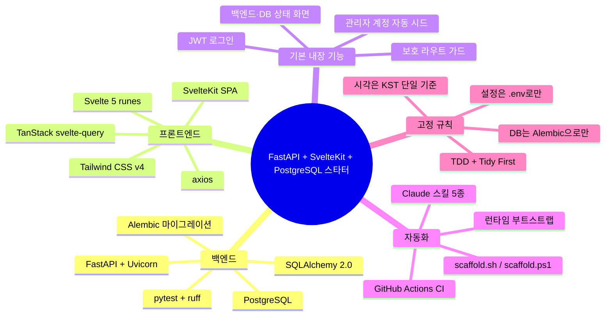
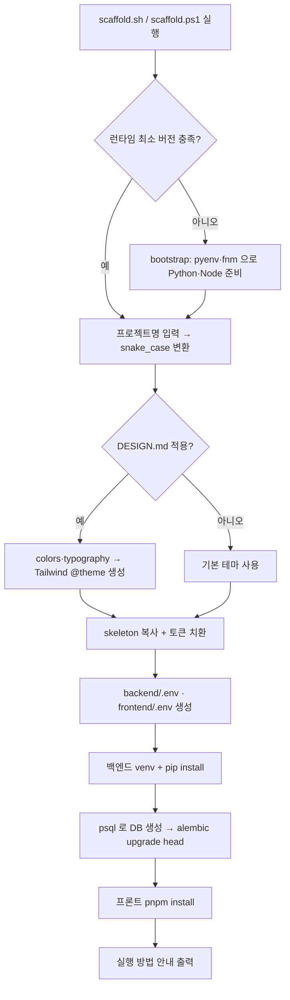
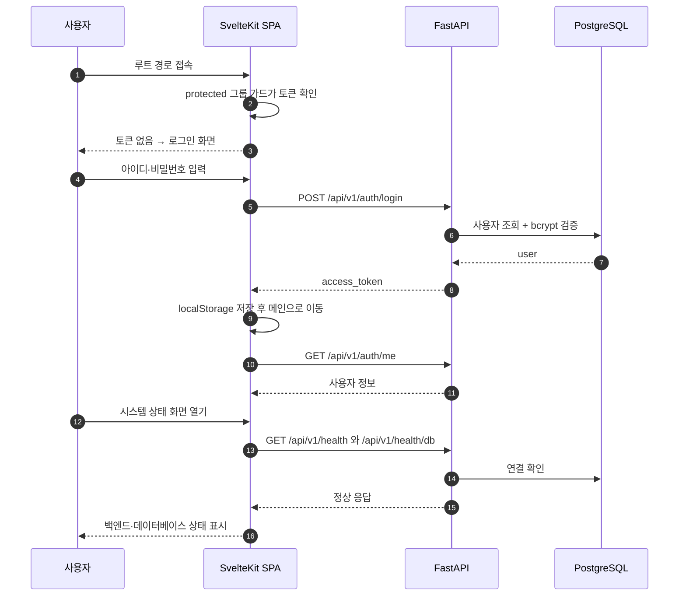
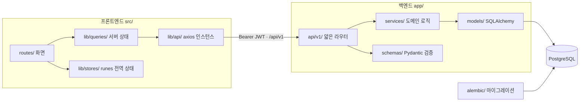

# FastAPI + SvelteKit + PostgreSQL 프로젝트 스타터 템플릿

신규 프로젝트를 **스크립트 한 번**으로 만든다.
모든 프로젝트의 기준(아키텍처·룰)의 원본(SSOT)은 이 폴더다.

```
_project-template/
├── scaffold.ps1            # ★ Windows (PowerShell) 스캐폴드
├── scaffold.sh             # ★ macOS / Linux (bash) 스캐폴드 — 동작 동일
├── DESIGN.md               # 디자인 토큰(색상/타이포) — 선택적으로 테마에 반영
├── README.md               # (이 파일)
└── skeleton/               # 새 프로젝트가 받는 골격 전체
    ├── CLAUDE.md           # 프로젝트 Claude 지침
    ├── plan.md             # TDD 작업 계획
    ├── README.md
    ├── .gitignore / .gitattributes
    ├── .github/pull_request_template.md
    ├── docs/architecture.md   # 공통 아키텍처 가이드 (상세 기준)
    ├── backend/            # FastAPI + SQLAlchemy + Alembic + pytest
    └── frontend/           # SvelteKit(SPA) + Svelte 5 + TS + Tailwind v4 + axios/svelte-query/runes
```

## 한눈에 보기

### 무엇이 들어 있나



### 스크립트 한 번으로 무슨 일이 일어나나



### 만들어진 앱이 실제로 도는 모습



### 요청이 흐르는 계층



> 계층 규칙: 라우터는 HTTP 만 얇게, 도메인 로직은 `services/`, 검증은 `schemas/`.
> 프론트는 서버 상태를 `lib/queries/` 로만 다루고 직접 패칭하지 않는다. 상세는 [`skeleton/docs/architecture.md`](skeleton/docs/architecture.md).

## 사용법 — OS별 스크립트

> 이 템플릿 폴더는 자신의 OS·작업 폴더로 복사해서 쓴다.
> 두 스크립트는 같은 `skeleton/`·`DESIGN.md` 를 사용하므로 어느 OS에서 만들어도 결과가 동일하다.

> **생성 위치(`-Target`/`--target`)를 지정하지 않으면** `_project-template` 의 **부모 폴더에 프로젝트명으로** 생성된다.
> 예: `project/_project-template/` 에서 실행하면 → `project/<프로젝트명>/` 에 생성. (대화형일 땐 기본값을 보여주고 Enter 로 수락)

### Windows (PowerShell) — `scaffold.ps1`

```powershell
# 대화형 (이름/위치/DB정보/DESIGN 적용여부를 물어봄)
.\scaffold.ps1

# 인자 지정
.\scaffold.ps1 -Name MyProject -Target C:\work\MyProject

# 골격만 빠르게 (DB·설치 생략)
.\scaffold.ps1 -Name Demo -Target .\Demo -SkipDb -SkipInstall
```

### macOS / Linux (bash) — `scaffold.sh`

```bash
chmod +x scaffold.sh          # 최초 1회 (실행 권한이 없을 때)

# 대화형
./scaffold.sh

# 인자 지정
./scaffold.sh --name MyProject --target ~/work/MyProject

# 골격만 빠르게
./scaffold.sh --name Demo --target ./Demo --skip-db --skip-install
```

| PowerShell | bash |
|-----------|------|
| `-Name` `-Target` | `--name` `--target` |
| `-SkipDb` `-SkipInstall` | `--skip-db` `--skip-install` |
| `-Design` `-NoDesign` | `--design` `--no-design` |
| `-DbHost/-DbPort/-DbUser/-DbPassword/-DbName` | `--db-host/--db-port/--db-user/--db-password/--db-name` |

### 스크립트가 하는 일 (전체 자동)

1. 이름/위치 입력 → `PascalCase`를 `snake_case`(DB명·토큰키)로 변환
2. **DESIGN.md 적용 여부 질문** → 적용 시 `colors`/`typography`를 Tailwind `@theme`로 변환해 `frontend/src/app.css`에 주입(+`docs/DESIGN.md` 복사)
3. `skeleton/` 복사 + 토큰 치환(`__PROJECT_NAME__`, `<프로젝트명>`, 테마)
4. **PostgreSQL 접속정보(host/port/user/password/db) 질문** → `backend/.env`·`frontend/.env` 생성(`DATABASE_URL`·`SECRET_KEY` 주입)
5. 백엔드: `python -m venv .venv` + `pip install -r requirements.txt`
6. **psql 로 DB 생성** → **Alembic `upgrade head` 로 테이블 생성**(DB는 항상 Alembic으로 관리 §11)
7. 프론트: `pnpm install`
8. 실행 방법(`uvicorn`, `pnpm dev`) 출력

### 옵션 플래그

| 플래그 | 효과 |
|--------|------|
| `-SkipDb` | psql DB 생성 + alembic 마이그레이션 생략 |
| `-SkipInstall` | venv/pip + pnpm install 생략 |
| `-Design` / `-NoDesign` | DESIGN.md 적용 강제 / 미적용 (질문 생략) |
| `-DbHost/-DbPort/-DbUser/-DbPassword/-DbName` | DB 접속정보 비대화형 지정 |

### 사전 요구사항 (PATH 에 있어야 함)

- Windows: `python` (3.10+), `pnpm`, `psql` (PostgreSQL)
- macOS/Linux: `python3` (3.10+), `pnpm`, `psql`
- 없으면 해당 단계는 안내 메시지와 함께 건너뛴다.

## 생성 직후

1. 스크립트가 출력한 대로 백엔드(`uvicorn`)·프론트(`pnpm dev`)를 실행
2. 브라우저 http://localhost:5173 → 랜딩 페이지에서 **백엔드·DB 연결 상태**가 "정상"이면 성공
3. Claude 에게: "`docs/architecture.md` 와 `plan.md` 따라 개발 시작" → TDD(Red→Green→Refactor)

## 기준이 바뀌면

- **원본만 수정**: `skeleton/docs/architecture.md`(+ 필요 시 `skeleton/CLAUDE.md`).
- `architecture.md` 상단의 **★ 핵심 MUST 요약**이 항상 최신 고정 규칙을 반영하도록 유지한다.
- 진행 중인 프로젝트는 필요할 때 변경분을 동기화한다.

> 전역 규칙(TDD / Tidy First / 커밋 형식 / PowerShell / pnpm / 한국어)은
> `~/.claude/CLAUDE.md`에 있으므로 프로젝트 `CLAUDE.md`에서 반복하지 않는다.

## 검증 상태

아래는 macOS(Darwin 25.5, Python 3.13.14 / Node 24.18.0 / pnpm 11.9.0)에서
`scaffold.sh` 로 실제 프로젝트를 생성해 확인한 결과다.

**통과 확인함**

- 스캐폴드: `--skip-db --skip-install --no-design` / `--design` 양쪽 exit 0.
  생성물에 `__PROJECT_NAME__` · `__PROJECT_SNAKE__` · `__THEME_CSS__` 잔재 없음
  (`.svelte` 포함, 토큰을 담은 골격 파일의 확장자는 모두 치환 대상에 포함된다)
- 토큰 치환: `app.html` `<title>`, `package.json` `name`, `token.ts` `TOKEN_KEY`,
  `main.py` FastAPI `title`, `backend/.env`·`frontend/.env` 생성 모두 정상
- 테마: `--no-design` 은 기본 `@theme`, `--design` 은 DESIGN.md 의 색상(`--color-primary: #00478d` 등)이
  `frontend/src/app.css` 에 주입되고 `docs/DESIGN.md` 가 복사됨
- 백엔드: `pip install -r requirements.txt` + `ruff check .` (통과) + `pytest -q` (7건 통과).
  `.env` 의 `DATABASE_URL` 이 PostgreSQL 을 가리켜도 테스트는 SQLite in-memory 픽스처를 쓰므로 영향 없음 (§12)
- Alembic: SQLite 기준 `upgrade head` / `downgrade base` (0001_initial → 0002_users, `app_meta`·`users` 테이블)
- 프론트: `pnpm install` · `pnpm lint` · `pnpm check`(`svelte-check` 286 파일 0 error 0 warning) · `pnpm build`
  네 개 모두 exit 0. `pnpm install` 이 `pnpm-workspace.yaml` 을 수정하지 않는 것도 해시 비교로 확인
- 구동: SQLite 로 `uvicorn app.main:app` 기동 후
  `GET /api/v1/health` → `{"status":"ok"}`, `GET /api/v1/health/db` → `{"db":"ok", ...}`,
  기본 관리자 시드(`admin`/`admin123`) 로그인 → access token 발급 → `GET /api/v1/auth/me` 200,
  토큰 없음/비밀번호 오류는 401
- 프론트 dev 서버: `/login` 이 SPA HTML 셸을 반환하고, `/api/v1/*` 요청이 dev proxy 로 백엔드에 전달됨
- 브라우저(Chrome) 실제 렌더링: 기본 포트(8000/5173)로 4개 화면 확인 —
  `/login` 로그인 → 메인(`/`) 에 사용자명 표시 → `/landing` 의 백엔드·데이터베이스 배지 모두 "정상" →
  `/my` 의 아이디·권한 표시. DESIGN.md 테마(`--color-primary` 등)가 실제 화면에 적용되고 콘솔 에러 없음
- 인증 가드: 로그아웃 후 보호 라우트(`/my`) 진입 시 `/login` 으로 리다이렉트됨

**미검증**

- PostgreSQL 경로: `--skip-db` 로 검증했으므로 `psql` DB 생성 + PostgreSQL 상대 `alembic upgrade head` 는
  확인하지 못했다. 마이그레이션은 SQLite 로만 검증했다.
- `scaffold.ps1`(Windows/PowerShell): 실행 환경이 없어 검증하지 못했다. bash 판과 동일한
  `skeleton/`·`DESIGN.md` 를 사용하지만 결과 동일성은 확인되지 않았다.
- 스캐폴드의 자동 설치 단계(`--skip-install` 없이 실행)는 거치지 않았다. pip/pnpm 설치는 수동으로 확인했다.

버전은 caret 범위이므로 필요 시 `pnpm up` / `pip` 로 갱신 가능하다.
